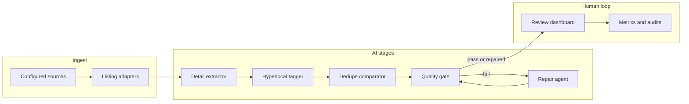

# Oberlin Community Calendar — AI Aggregation Pilot

**AI Micro-Grant Pilot (concept)**  
**Team:** Frank Kusi Appiah (student researcher) and John Petersen (faculty sponsor) — Oberlin College, Engineering / Computer Science, 3–2 Engineering Program.  
**Community partner context:** This work supports [Environmental Dashboard](https://www.environmentaldashboard.org/) community calendar infrastructure ([public calendar](https://environmentaldashboard.org/calendar)), which powers web displays, community dashboard signs, and newsletter content.

This repository implements a **research prototype**: an automation service that discovers events from multiple institutional and community sources, **extracts structured fields** aligned with the dashboard submission form, **tags geographic scope** for hyperlocal routing, **checks quality** (completeness and link health), and surfaces everything in a **review dashboard** with **auditable metrics** so humans can vet proposals before they enter the unified calendar.

---

## The problem (why this pilot exists)

Oberlin’s organizations run **many separate calendars** (different CMS tools, fields, and layouts). Simple scraping does not produce **one consistent schema** for a shared community feed. The pilot asks whether **LLM-backed agents** plus **browser automation** can:

- Find public event listings and deep links as they change.
- Normalize titles, times, descriptions, categories, links, and attribution.
- Flag duplicates against existing staging data and the live hub snapshot.
- Reduce manual copy-paste while keeping **source credit** and **human approval** in the loop.

A longer-term vision (aligned with Dashboard work elsewhere in Ohio) is to **scale and tag** content by geographic relevance (campus, city, county, region) so displays can mix hyperlocal and broader items appropriately.

### Community Hub and APIs

The live [Environmental Dashboard calendar](https://environmentaldashboard.org/calendar) does **not** expose a **public machine-readable “Community Hub API”** for listing everything that is already published. This project therefore:

- Builds a **local mirror** in SQLite (`community_hub_events`) by **opening the public calendar page** with Playwright MCP and having a model **extract** visible rows (see `adapters/agentHubSnapshot.js`). That mirror is **best-effort** and **model-dependent**, not a full authoritative export.
- Exposes **`/api/community-hub-events`** on **this automation service** only: it reads/writes **our** mirror for dedupe and research—not an upstream Hub REST API.

Humans still use the normal **web form** to submit events to the real hub; this repo prepares records that **match that form shape** for vetting first.

---

## What’s in this repo

| Piece | Role |
|--------|------|
| **`src/automation/server.js`** | Express API, static dashboard (`public/`), health and metrics endpoints. |
| **`src/automation/service.js`** | Orchestrates sources → listing → detail → hyperlocal → dedupe → **quality gate → repair loop**. |
| **`src/automation/db.js`** | SQLite persistence: sources, candidates, staging events, hub mirror, runs, reviews, **agent feedback** for prompt guidance. |
| **`public/index.html`** | Operations / Review / Failures / Research workspaces: filters, keyboard shortcuts, trends, failure triage, learning feedback. |
| **Playwright MCP** | Optional sibling service (`npm run start:browser`) for remote browser tools used by listing/detail agents. |

**Pilot methodology & metrics:** see [`docs/RESEARCH.md`](docs/RESEARCH.md) (`GET /api/research/snapshot`, `npm run research:snapshot`, `npm run eval:pilot`).

**Cost / ops:** see [`docs/COST_CONTROLS.md`](docs/COST_CONTROLS.md). **URL backfill after deploy:** `npm run backfill:canonical -- --dry-run` then `npm run backfill:canonical`.

---

## Agent roster (names you’ll see in code and metrics)

Agents are **modular steps**, not separate long-running processes. Canonical **`fault_agent`** strings (used when reviewers reject an event or when QA attributes an issue) include:

| Agent (concept) | Module / entry | `fault_agent` key | Role |
|-----------------|----------------|-------------------|------|
| **Listing collector** | `adapters/browser.js`, `adapters/agentListing.js`, `adapters/localist.js`, `adapters/ics.js` | `listing_agent` | Discovers event URLs (browser + MCP and/or structured feeds). |
| **Detail extractor** | `adapters/agentDetail.js` | `detail_extractor` | Opens event pages via MCP, returns **Community Hub–shaped** JSON; fallbacks + completeness scoring. |
| **Hyperlocal tagger** | `agents/agentHyperlocal.js` | `hyperlocal_agent` | Classifies geographic scope (campus/city/county/region/etc.) from event text. |
| **Dedupe comparator** | `agents/agentDedupe.js` | `dedupe_agent` | LLM compare against staging + hub snapshot context. |
| **Quality gate** | `agents/agentQualityGate.js` | *(per-issue; often `detail_extractor`)* | Required-field checks + HTTP checks on key URLs / image content-type. |
| **Repair agent** | `agents/agentRepair.js` | — | Re-runs detail extraction with **targeted repair hints** when issues are recoverable. |
| **Hub snapshot** | `adapters/agentHubSnapshot.js` | — | Syncs published hub calendar into DB for dedupe alignment (not a “fault” agent). |
| **Poster extractor** | `agents/agentPoster.js` | — | **Research feature:** vision model extracts events from **poster images** (grant exploration). |

Automated QA also writes rows to **`agent_feedback`** with `reviewer_name: "qa_agent"` so repeated failure modes show up in **Learning Feedback** panels.

---

## Pipeline (high level)



---

## Human review, accuracy, and the learning loop

The dashboard is designed for **research-grade operations**, not just throughput:

- **Rejections** capture `rejection_reason` and `fault_agent`; data is stored for **prompt guidance** on the next runs of detail / hyperlocal / dedupe agents.
- **Staging reviews** and baselines support **correction-rate** and **field-level** accuracy views.
- **Source health** explains *why* a source looks inactive or unhealthy (env, timeout, parse errors, etc.).
- **QA metadata** on events (`qa_status`, `qa_issues`, completeness) explains auto-rejects without digging through logs.

---

## Configuration and environment

| Variable | Purpose |
|----------|---------|
| `OPENAI_API_KEY` | Required for OpenAI-backed agents. |
| `MCP_BROWSER_URL` or `PLAYWRIGHT_MCP_URL` | Base URL to Playwright MCP (e.g. `/mcp` on your MCP host). |
| `COMMUNITY_HUB_CALENDAR_URL` | Optional override for hub snapshot (defaults to Environmental Dashboard calendar). |
| `SKIP_PAST_EVENTS` | Default `true`: auto-reject events whose start is in the past (still stored for audit). Set `false` to disable. |
| `PAST_EVENT_GRACE_HOURS` | Optional grace window before treating an event as “past.” |
| `RESEARCH_EXPERIMENT_ID` | Optional label recorded in successful `source_runs` summaries for cohort tracking. |
| `OPENAI_DEDUPE_ENABLED` | Default `true` (set `false` to save cost). LLM duplicate check uses hub mirror + staging context. |
| `HUB_SYNC_INTERVAL_MS` | Min milliseconds between automatic hub page snapshots (default **1 hour** on the server; Render example `3600000`). Lower = fresher dedupe memory, more MCP usage. |

Source definitions are seeded from `data/sources.example.json` when configured; the live DB is SQLite under the automation data path (see `src/automation/config.js`).

---

## Running locally

```bash
npm install
# Terminal A — browser MCP (if you use OpenAI listing / detail with MCP tools)
npm run start:browser

# Terminal B — automation API + dashboard
export OPENAI_API_KEY=sk-...
export MCP_BROWSER_URL=https://your-mcp-host.example.com/mcp
npm run start:automation
```

Open the dashboard at the URL logged by the automation server (default port from env or config).

**Tests (no live OpenAI/MCP calls in smoke):**

```bash
npm run test:smoke
npm run test:accuracy
```

---

## Suggested improvements (toward a “perfect,” intuitive system)

Aligned with the grant narrative and current codebase, high-value next steps include:

1. **Publication bridge** — One-click or batch “submit approved staging event to hub” with idempotency and error surfacing.
2. **Source-level playbooks** — Per-source extraction notes and `adapter_config` presets surfaced in the UI (AMAM, Experience Oberlin, etc.).
3. **Stronger duplicate UX** — Side-by-side diff with hub/staging match and quick “merge fields” actions.
4. **Jobs board parity** — Parallel schema and agents for job postings (mentioned in the broader Dashboard roadmap).
5. **Accessibility review** — Ensure generated short descriptions and exported views meet WCAG-oriented checks for the public calendar.
6. **Cost and quota dashboards** — Per-source token/API estimates for sustainable operations (pilot budgeting).
7. **IRB / data handling docs** — Formal data retention and attribution policy as the pilot moves beyond public-event-only scraping.

---

## Ethics and data use (pilot)

Consistent with the application: use **only publicly posted** event information intended to attract participants; **attribute sources**; avoid collecting restricted or private data; design for **accurate representation** and **broad usability** of published calendar content.

---

## Budget note (from application)

The submitted budget includes API access, cloud infrastructure, and student research support (total **$5,000**). Line items should be double-checked for typos in the original PDF (e.g. infrastructure figures) before submission.

---

## License and contributions

This project is developed for **Oberlin College / Environmental Dashboard** research and operations. Add a `LICENSE` file if the repo is opened more broadly.

For questions about the pilot or deployment, contact the faculty sponsor or maintainers named in the grant application.
